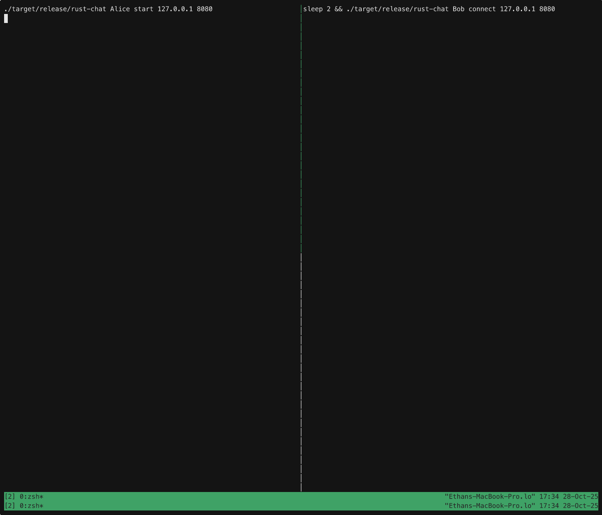

# rust-chat

A simple TCP chat application for the terminal



## Build

```bash
cargo build --release
```

## Usage

Start a server:
```bash
./target/release/rust-chat Alice start 127.0.0.1 8080
```

Connect as a client:
```bash
./target/release/rust-chat Bob connect 127.0.0.1 8080
```

Type messages and press Enter. Type `exit` to quit.

## Features

- Color-coded usernames
- Timestamps on messages
- Real-time TCP communication
- Raw terminal mode for clean input

## Todo
- TLS for privacy
